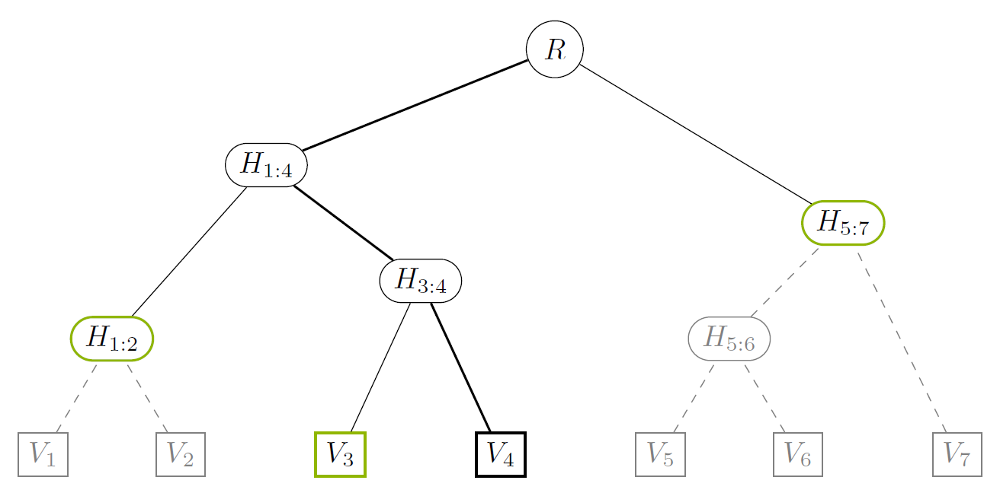

# Explainer of proofs

This document briefly explains the basics of the [`MapProof`](proof.rs) construction
and verification.

Assume we have a `ProofMapIndex` with 7 values, `V1` .. `V7`, and
the corresponding intermediate nodes `H[1:2]`, `H[3:4]`, …, and the root `R`.



Denote `key(V)` the key of the node `V` of the tree. For example, `key(H[1:2])`
is equal to the largest common prefix of `key(V1)` and `key(V2)`.
Denote `hash(V)` the hash of the node `V` of the tree, calculated as a hash
of data for leaf nodes / entries and a hash depending on the hashes and keys of
children for branches.

## Proof for a single node

Assume we want to create a proof of existence for `V4`. To do this, we need to
select a minimum subtree from the tree above, which would satisfy following
criteria:

- Reveal `V4`
- Allow to reconstruct the root hash of the index

The corresponding subtree is marked as non-grayed nodes and edges in the figure
above. It contains the following leafs: `V4` (supplied in full); `V3`, `H[1:2]`
and `H[5:7]` (supplied as hashes). The core observation is as follows:

> Leaf nodes of the subtree together with their keys are sufficient
> to restore the subtree and calculate the root hash of the index.

That is, the proof can consist of an entry `(key(V4), V4)` together with auxiliary
information:

```none
[
  (key(H[1:2]), hash(H[1:2])),
  (key(V3), hash(V3)),
  (key(H[5:7]), hash(H[5:7]))
]
```

### Constructing Proof

> **Source code:** `ProofMapIndex::get_proof`

To construct the proof, we start from the root `R` and descend
using the searched key (i.e., `key(V4)`) to choose directions.
(The descent is shown as a bold line in the figure above.)
We keep 2 arrays:

- `l` for nodes in the proof to the left of the searched node
- `r` for nodes to the right of it

Each time we go to the right, we push the other (i.e., left) child
of the junction node to the end of `l`. Conversely, if we go to the left,
we add the other (right) child of the junction to the beginning of `r`.
The search ends when we reach the leaf node of the index tree with the searched
key, or neither of the children of the current junction matches; in the latter
case, we add both its children to `l` and `r` as described above.

After the termination, `l + r` (the concatenation of arrays) contains all nodes
in the proof. Moreover, it is easy to see that the keys in the combined array are
sorted in the increasing order.

### Verifying Proof

> **Source code:** `MapProof::check`

The proof verification is essentially computing the root of the index given
the data in the proof. Given the proof structure described above, we can restore
a proof subtree and calculate the hash directly. The actual implementation
is slightly more complex: instead of constructing a subtree, we emulate
adding nodes to it iteratively in the order of increasing keys, keeping in memory
just the right-most nodes of the subtree (we call these nodes a *contour*)
and "finalizing" them as we go along. The finalization procedure is as follows:

Two last nodes in the contour `C` can be collapsed into a single node if
and only if the common prefix of these nodes

```none
cp_last := common_prefix(C[-2], C[-1])
```

is longer than the common prefix between the last node in the contour
and the node `V` currently being added to the contour, i.e.,

```none
cp_next := common_prefix(C[-1], V).
```

Let us cover this procedure on the proof for `V4`:

1. The entries in the proof are ordered by increasing key: `H[1:2]`, `V3`,
  `V4`, `H[5:7]`.
2. We move first two nodes into the contour: `C := [ H[1:2], V3 ]`.
3. We now start processing the third node, `V4`. First, we check if the 2 latest
  nodes in the contour can be finalized, i.e., collapsed into a single node.
  The common prefix between nodes in the contour is `key(H[1:4])`, and a one
  involving `V4` is `key(H[3:4])`. The second prefix is longer, meaning that
  no nodes should be finalized.
4. We add `V4` to the contour: `C := [ H[1:2], V3, V4 ]`.
5. We add `H[5:7]` to the contour. The common prefix with `C[-1]` is `key(R)`,
  which is shorter than `key(H[3:4])`. This means `V3` and `V4` can be replaced
  with their combination, i.e., `H[3:4]`: `C := [ H[1:2], H[3:4] ]`.
6. The common prefix between two nodes in the contour is `key(H[1:4])`, i.e.,
  still shorter than the prefix with the new node, `key(R)`. The contour is
  reduced to a single node: `C := [ H[1:4] ]`.
7. We cannot collapse nodes in the contour any longer, so we finally add the
  new node: `C := [ H[1:4], H[5:7] ]`.
8. We have run out of nodes to add to the contour, so we start collapsing nodes
  in it, staring from the end. In our case, this procedure has a single
  iteration, after which `C := [ R ]`.
9. We return the hash of the remaining node in the contour.

It is easy to see that the above procedure works for any number of revealed
nodes in the proof.
