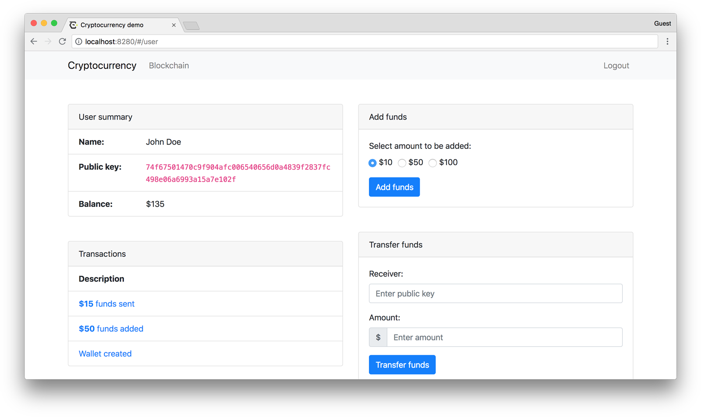

# Cryptocurrency Advanced: Service with Data Proofs

The extended version of the
[Cryptocurrency Service](https://github.com/exonum/exonum/tree/master/examples/cryptocurrency)
implementing data proofs. This project demonstrates how to bootstrap your own
cryptocurrency with [Exonum blockchain](https://github.com/exonum/exonum).

See [the documentation](https://exonum.com/doc/version/latest/get-started/data-proofs/)
for a detailed step-by-step guide how to approach this example.



Exonum blockchain keeps balances of users and handles secure
transactions between them.

It implements the following basic operations:

- Create a new user
- Add funds to the user's balance
- Transfer funds between users

## Install and Run

### Using Docker

Simply run the following command to start the cryptocurrency service on 4 nodes
on the local machine:

```bash
docker run -p 8000-8008:8000-8008 exonumhub/exonum-cryptocurrency-advanced:v1.0.0-rc.1
```

Ready! Find demo at [http://127.0.0.1:8008](http://127.0.0.1:8008).

Docker will automatically pull image from the repository and
run 4 nodes with public endpoints at `127.0.0.1:8000`, ..., `127.0.0.1:8003`
and private ones at `127.0.0.1:8004`, ..., `127.0.0.1:8007`.

To stop docker container, use `docker stop <container id>` command.

### Manual Installation

#### Prerequisites

Be sure you installed necessary packages:

- [git](https://git-scm.com/downloads)
- [Node.js with npm](https://nodejs.org/en/download/)
- [Rust compiler](https://rustup.rs/)
- [Exonum launcher](https://github.com/exonum/exonum-launcher)

#### Install and Run

Below you will find a step-by-step guide to starting the cryptocurrency
service on 4 nodes on the local machine.

Build the project:

```sh
git clone https://github.com/exonum/exonum
cd exonum/examples/cryptocurrency-advanced/backend
cargo install --path .
```

Generate node configuration template:

```sh
mkdir example
exonum-cryptocurrency-advanced generate-template \
  example/common.toml \
  --validators-count 4
```

Generate public and secret keys for each node:

```sh
exonum-cryptocurrency-advanced generate-config \
  example/common.toml example/1 \
  --peer-address 127.0.0.1:6331 -n
exonum-cryptocurrency-advanced generate-config \
  example/common.toml example/2 \
  --peer-address 127.0.0.1:6332 -n
exonum-cryptocurrency-advanced generate-config \
  example/common.toml example/3 \
  --peer-address 127.0.0.1:6333 -n
exonum-cryptocurrency-advanced generate-config \
  example/common.toml example/4 \
  --peer-address 127.0.0.1:6334 -n
```

Note that in case of copying file with master key to the other machines,
you must change the access permissions of this file for every machine.
For example:

```sh
sudo chmod 600 master.key.toml
```

Finalize configs:

```sh
exonum-cryptocurrency-advanced finalize \
  --public-api-address 0.0.0.0:8200 \
  --private-api-address 0.0.0.0:8091 \
  example/1/sec.toml example/1/node.toml \
  --public-configs example/{1,2,3,4}/pub.toml

# Similar commands for other 3 nodes, with adjusted paths and socket addresses
```

Run nodes:

```sh
exonum-cryptocurrency-advanced run \
  --node-config example/1/node.toml \
  --db-path example/1/db \
  --public-api-address 0.0.0.0:8200 \
  --master-key-pass pass

# Similar commands for other 3 nodes, with adjusted paths and socket addresses
```

#### Deploy Service

Before service deploy, make sure that you have pure Python implementation
of Protobuf:

```sh
pip uninstall protobuf
pip install --no-binary=protobuf protobuf
```

The service can be deployed as follows:

```sh
python3 -m exonum_launcher -i ../cryptocurrency_advanced.yaml
```

#### Run Frontend

Install frontend dependencies:

```sh
cd ../frontend
npm install
```

Build sources:

```sh
npm run build
```

Run the frontend:

```sh
npm start -- --port=8280 --api-root=http://127.0.0.1:8200
```

- `--port` is a port for Node.JS app.
- `--api-root` is a root URL of public API address of one of nodes.

Ready! Find demo at [http://127.0.0.1:8280](http://127.0.0.1:8280).

Read the [frontend tutorial] to get detailed information about the interaction
of the client with the Exonum blockchain.

## License

Cryptocurrency demo is licensed under the Apache License (Version 2.0).
See [LICENSE](LICENSE) for details.

[frontend tutorial]: https://exonum.com/doc/version/latest/get-started/light-client/
