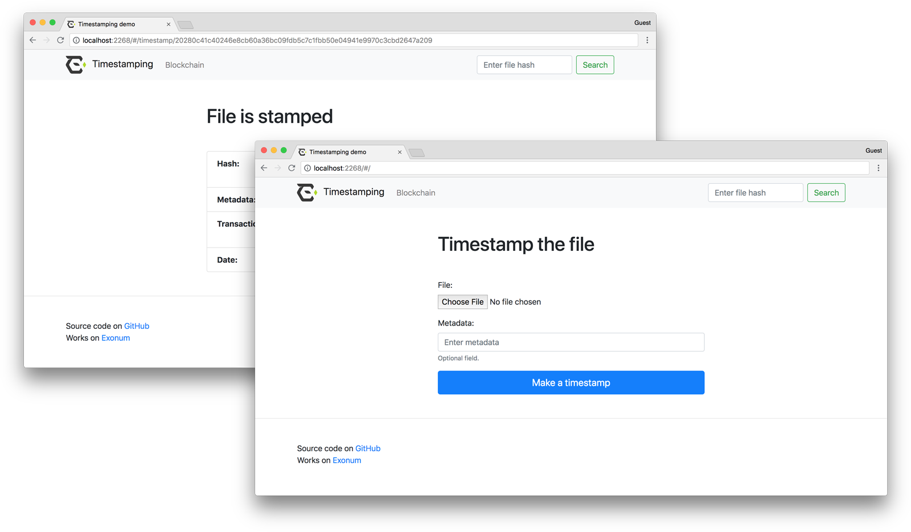

# Timestamping: Example Service

This project demonstrates how to create simple timestamping service
using [Exonum blockchain](https://github.com/exonum/exonum).



## Getting started

Be sure you installed necessary packages:

* [git](https://git-scm.com/downloads)
* [Rust](https://rustup.rs/)
* [Node.js & npm](https://nodejs.org/en/download/)
* [Exonum launcher](https://github.com/exonum/exonum-launcher)

## Install and run

### Using docker

Simply run the following command to start the timestamping service on 4 nodes
on the local machine:

```bash
docker run -p 8000-8008:8000-8008 exonumhub/exonum-timestamping:v1.0.0-rc.1
```

Ready! Find demo at [http://127.0.0.1:8008](http://127.0.0.1:8008).

Docker will automatically pull image from the repository and
run 4 nodes with public endpoints at `127.0.0.1:8000`, ..., `127.0.0.1:8003`
and private ones at `127.0.0.1:8004`, ..., `127.0.0.1:8007`.

To stop docker container, use `docker stop <container id>` command.

### Manually

#### Getting started

Be sure you installed necessary packages:

* [git](https://git-scm.com/downloads)
* [Node.js with npm](https://nodejs.org/en/download/)
* [Rust compiler](https://rustup.rs/)

#### Install and run

Below you will find a step-by-step guide to start the service
on 4 nodes on the local machine.

Clone the project and install Rust dependencies:

```sh
git clone https://github.com/exonum/exonum

cd exonum/examples/timestamping/backend

cargo install --path .
```

Generate blockchain configuration:

```sh
mkdir example

exonum-timestamping generate-template example/common.toml --validators-count 4
```

Generate templates of nodes configurations:

<!-- markdownlint-disable MD013 -->

```sh
exonum-timestamping generate-config example/common.toml  example/1 --peer-address 127.0.0.1:6331 -n

exonum-timestamping generate-config example/common.toml  example/2 --peer-address 127.0.0.1:6332 -n

exonum-timestamping generate-config example/common.toml  example/3 --peer-address 127.0.0.1:6333 -n

exonum-timestamping generate-config example/common.toml  example/4 --peer-address 127.0.0.1:6334 -n
```

Note that in case of copying file with master key to the other machines, you must change the access permissions of this file for every machine.
For example:

```sh
sudo chmod 600 master.key.toml
```

Finalize generation of nodes configurations:

```sh
exonum-timestamping finalize --public-api-address 0.0.0.0:8200 --private-api-address 0.0.0.0:8091 example/1/sec.toml example/1/node.toml --public-configs example/{1,2,3,4}/pub.toml

exonum-timestamping finalize --public-api-address 0.0.0.0:8201 --private-api-address 0.0.0.0:8092 example/2/sec.toml example/2/node.toml --public-configs example/{1,2,3,4}/pub.toml

exonum-timestamping finalize --public-api-address 0.0.0.0:8202 --private-api-address 0.0.0.0:8093 example/3/sec.toml example/3/node.toml --public-configs example/{1,2,3,4}/pub.toml

exonum-timestamping finalize --public-api-address 0.0.0.0:8203 --private-api-address 0.0.0.0:8094 example/4/sec.toml example/4/node.toml --public-configs example/{1,2,3,4}/pub.toml
```

Run nodes:

```sh
exonum-timestamping run --node-config example/1/node.toml --db-path example/1/db --public-api-address 0.0.0.0:8200 --master-key-pass pass

exonum-timestamping run --node-config example/2/node.toml --db-path example/2/db --public-api-address 0.0.0.0:8201 --master-key-pass pass

exonum-timestamping run --node-config example/3/node.toml --db-path example/3/db --public-api-address 0.0.0.0:8202 --master-key-pass pass

exonum-timestamping run --node-config example/4/node.toml --db-path example/4/db --public-api-address 0.0.0.0:8203 --master-key-pass pass
```

Before service deploy make sure that you have pure python implementation of protobuf:

```sh
pip uninstall protobuf
pip install --no-binary=protobuf protobuf
```

Deploy timestamping service.

```sh
python3 -m exonum_launcher -i ../timestamping.yaml
```

<!-- markdownlint-enable MD013 -->

Install frontend dependencies:

```sh
cd ../frontend

npm install
```

Build sources:

```sh
npm run build
```

Run the application:

```sh
npm start -- --port=2268 --api-root=http://127.0.0.1:8200
```

`--port` is a port for Node.JS app.

`--api-root` is a root URL of public API address of one of nodes.

Ready! Find demo at [http://127.0.0.1:2268](http://127.0.0.1:2268).

## License

Timestamping demo is licensed under the Apache License (Version 2.0).
See [LICENSE](LICENSE) for details.
