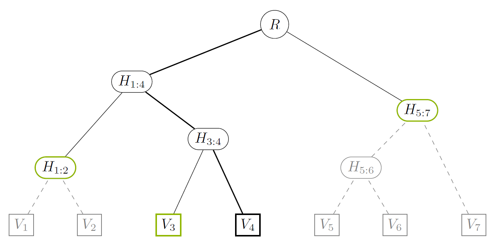

# Explainer of proofs

This document briefly explains the basics of the [`MapProof`](proof.rs) construction
and verification.

Assume we have a `ProofMapIndex` with 7 values, `V1` .. `V7`, and
the corresponding intermediate nodes `H[1:2]`, `H[3:4]`, …, and the root `R`.



Denote `key(V)` the key of the node `V` of the tree. For example, `key(H[1:2])`
is equal to the largest common prefix of `key(V1)` and `key(V2)`.
Denote `hash(V)` the hash of the node `V` of the tree, calculated as a hash
of data for leaf nodes / entries and a hash depending on the hashes and keys of
children for branches.

## Proof for a single node

Assume we want to create a proof of existence for `V4`. To do this, we need to
select a minimum subtree from the tree above, which would satisfy following
criteria:

- Reveal `V4`
- Allow to reconstruct the root hash of the index

The corresponding subtree is marked as non-grayed nodes and edges in the figure
above. It contains the following leafs: `V4` (supplied in full); `V3`, `H[1:2]`
and `H[5:7]` (supplied as hashes). The core observation is as follows:

> Leaf nodes of the subtree together with their keys are sufficient
> to restore the subtree and calculate the root hash of the index.

That is, the proof can consist of an entry `(key(V4), V4)` together with auxiliary
information:

```none
[
  (key(H[1:2]), hash(H[1:2])),
  (key(V3), hash(V3)),
  (key(H[5:7]), hash(H[5:7]))
]
```

### Constructing Proof

> **Source code:** `ProofMapIndex::get_proof`

To construct the proof, we start from the root `R` and descend
using the searched key (i.e., `key(V4)`) to choose directions.
(The descent is shown as a bold line in the figure above.)
We keep 2 arrays:

- `l` for nodes in the proof to the left of the searched node
- `r` for nodes to the right of it

Each time we go to the right, we push the other (i.e., left) child
of the junction node to the end of `l`. Conversely, if we go to the left,
we prepend the other (right) child of the junction to the beginning of `r`.
The search ends when we reach the leaf node of the index tree with the searched
key, or neither of the children of the current junction matches; in the latter
case, we add both its children to `l` and `r` as described above.

After the termination, `l + r` (the concatenation of arrays) contains all nodes
in the proof. Moreover, it is easy to see that the keys in the combined array are
sorted in the increasing order.

### Verifying Proof

> **Source code:** `MapProof::check`

The proof verification is essentially computing the root of the index given
the data in the proof. Given the proof structure described above, we can restore
a proof subtree and calculate the hash directly. The actual implementation
is slightly more complex: instead of constructing a subtree, we emulate
adding nodes to it iteratively in the order of increasing keys, keeping in memory
just the right-most nodes of the subtree (we call these nodes a *contour*)
and "finalizing" them as we go along.

Let us cover this procedure on the proof for `V4`:

1. The entries in the proof are ordered by increasing key: `H[1:2]`, `V3`,
  `V4`, `H[5:7]`.
2. `H[1:2]` is added into the contour.
3. We add `V3` to the contour. We determine the intersection between `V3`
  and the current contour, which is `key(H[1:4])`. We move `H[1:2]`
  out of the contour, replacing it with info on `H[1:4]` we know so far:
  its left child `H[1:2]`. Then, we push `V3` to the contour as well.
4. We add `V4` to the contour. Again, this starts from determining the intersection
  with the current contour, `key(H[3:4])`. We replace `V3` in the contour with
  the info on `H[3:4]`, and add `V4` to the contour.
5. We add `H[5:7]` to the contour. The intersection with the previous contour is
  `key(R)`. This means that all entries in the contour should be finalized.
  The finalization is implemented as follows: we use the previously remembered information
  about `H[3:4]` (i.e., its left child `V3`), augment it with the now finalized
  right child `V4` and calculate `hash(H[3:4])`. Then, we repeat procedure with
  `H[1:4]` as the branch and `H[3:4]` as the terminal node, obtaining `hash(H[1:4])`.
  Finally, as in 2 previous cases, we add `R` into the contour together with
  information about its left child `H[1:4]`. Then, we add `H[5:7]` into
  the contour as well.
6. At this point, we have run out of nodes in the proof, so we finalize the remaining
  nodes in the contour. That is, we assume `H[5:7]` as the final right child
  of `R` and calculate `hash(R)`.

It is easy to see that the above procedure works for any number of revealed
nodes in the proof.
